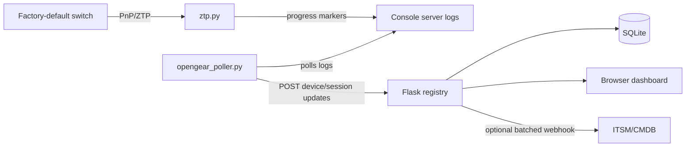

# Architecture

Network ZTP Registry is split into four small responsibilities:

- **Registry API** - Flask service that owns the SQLite device registry, serves
  the dashboard, emits Server-Sent Events, and exposes CRUD endpoints.
- **Dashboard** - self-contained HTML/CSS/JavaScript UI for staging progress,
  device editing, CSV export, label printing, and ad hoc playbook execution.
- **Console poller** - optional process that reads console-server port logs,
  parses ZTP markers, and posts completed device records to the registry.
- **On-device ZTP script** - Python script served to factory-default switches by
  DHCP/PnP. It applies bootstrap configuration and emits structured progress
  markers to the console.

The public demo skips the switch, DHCP, and console-server pieces. It seeds
synthetic device records directly into the registry API so reviewers can inspect
the dashboard and data model locally.
